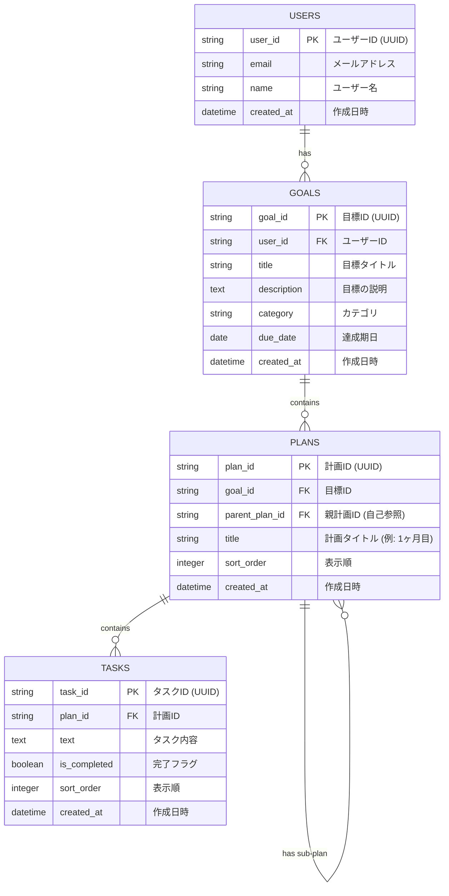

# Dream-gpt開発設計書

## 要件定義
1. 目標から自動で計画立案
2. Todo表にして進捗率を管理
3. カレンダーにTodoの期間を表示してスケジュール感をつかむ
4. ログイン、サインイン機能
5. ユーザー設定機能
   
## 画面設計
1. トップページ（LP）
2. ダッシュボード画面　SAPで開発
3. 目標制作画面
4. Todo画面
5. カレンダー画面
6. ユーザー設定画面
7. サインイン画面
8. ログイン画面
   
## データベース設計

