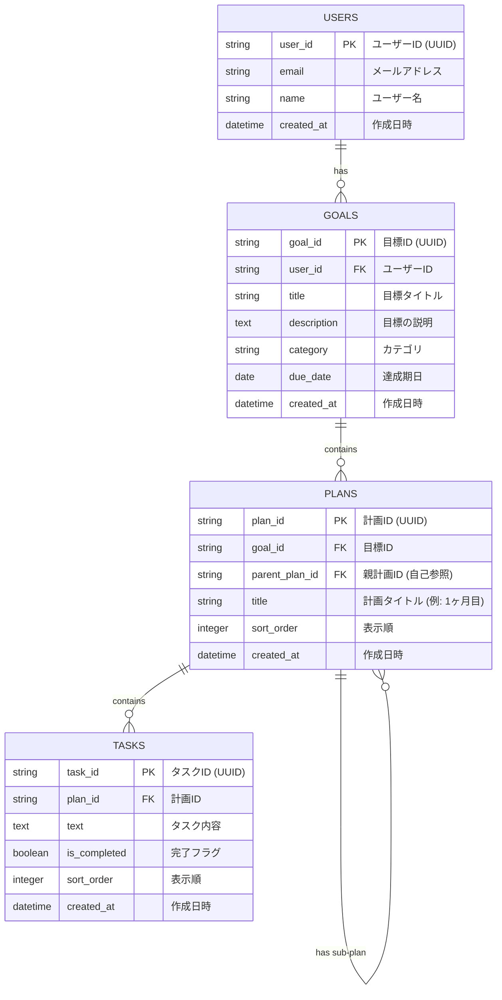
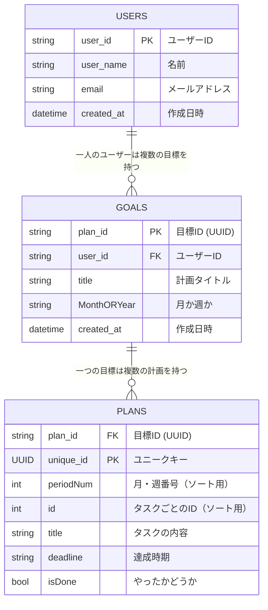

# Dream-gpt 開発設計書

# 要件定義

1. 目標から自動で計画立案
2. Todo 表にして進捗率を管理
3. カレンダーに Todo の期間を表示してスケジュール感をつかむ
4. ログイン、サインイン機能
5. ユーザー設定機能

# 画面設計

1. トップページ（LP）
2. ダッシュボード画面　 SAP で開発
3. 目標作成画面
4. Todo 画面
5. カレンダー画面
6. ユーザー設定画面
7. サインイン画面
8. ログイン画面

## 1. トップページ（LP）

ここは適当でいい

## 2. ダッシュボード画面

1. navber
2. sidebar

## 3. 目標作成画面

1. 目標
2. 期間
   1. 数字　 input で数字だけ入力されるようにバリデーション
   2. 単位（月、年）プルダウンメニューで選択
3. 備考（使用する教材などの指定）

## 4. Todo 画面

1. ユーザーごとの目標一覧をプルダウンで選択
2. 計画を月、または年ごとに分ける。(ユーザーの目標作成時の選択によって変わる。)
3. Todo カードとして作成、達成率などを表示したい。
4. 目標の削除機能

# データベース設計

### 初期案



### 改善案


### sql
```sql

-- ① Users テーブル作成（まだ作っていない場合）
CREATE TABLE IF NOT EXISTS public."Users" (
  "userId" uuid PRIMARY KEY,
  name text DEFAULT 'GUEST',
  "createdAt" timestamp with time zone DEFAULT now()
);

-- ② トリガー関数作成
CREATE OR REPLACE FUNCTION public.handle_new_user()
RETURNS TRIGGER AS $$
BEGIN
  INSERT INTO public."Users" ("userId", name, "createdAt")
  VALUES (NEW.id, 'GUEST', now());
  RETURN NEW;
END;
$$ LANGUAGE plpgsql;

-- ③ トリガー作成
CREATE TRIGGER on_auth_user_created
AFTER INSERT ON auth.users
FOR EACH ROW
EXECUTE FUNCTION public.handle_new_user();


```

## AI から期待されるデータ構造

```javascript


   {
    monthOrYear: month,
    plan:
        [1:{
           title: 一章を勉強する, deadline: 2025-11-01,
           title: 一章を勉強する, deadline: 2025-11-01,
           title: 一章を勉強する, deadline: 2025-11-01,
           title: 一章を勉強する, deadline: 2025-11-01,
       },
       2:{
           title: 一章を勉強する, deadline: 2025-11-01,
           title: 一章を勉強する, deadline: 2025-11-01,
           title: 一章を勉強する, deadline: 2025-11-01,
           title: 一章を勉強する, deadline: 2025-11-01,
       }]


   }


```
